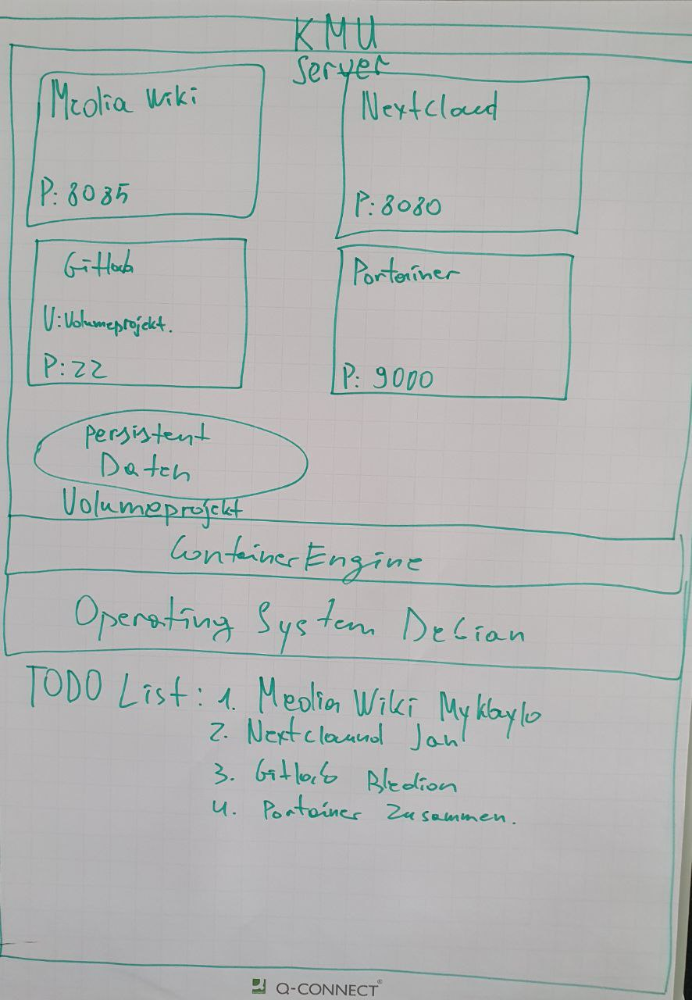

# Images
- gitlab/gitlab-ce:laters
- mysql:latest
- nextcloud:latest
- mediawiki:latest
- portainer:latest

# Passwörter
The passwords are set as a env variable on the host system so the guest systems can rely on those

# Plan

# Dependence on databases

1. Passwort: KUZ35_:3434FEfwew*1

# Arbeitsjournal
Name | Jan | Mykhaylo | Bledion
---- | --- | -------- | -------
17.06.2024 | . | . | .
